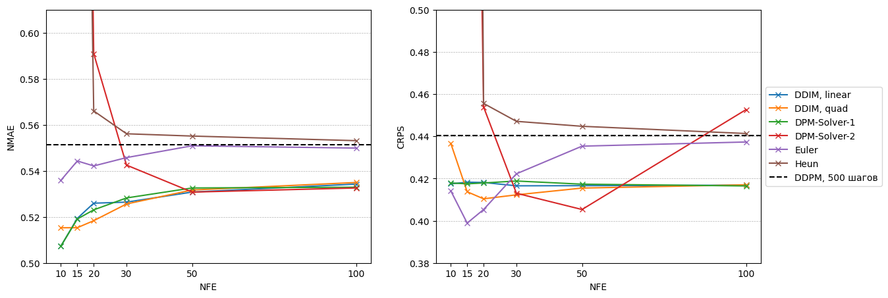
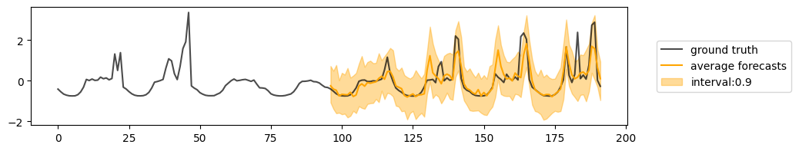

# Реализация поддержки различных методов сэмплирования для TimeGrad, CSDI, SSSD 
Выполнено в рамках ВКР "Ускорение глубоких диффузионных моделей для вероятностного прогнозирования", основной задачей которого являлось исследование применения StyleGAN2 для решения задачи сегментации портретных изображений без учителя. 

### Аннотация
Диффузионные модели нашли широкое применение в различных областях, в том числе и в прогнозировании временных рядов.  Однако современные подходы, использующие диффузионные модели, уступают другим методам по времени инференса из-за итеративной процедуры расшумления, при этом по качеству прогнозирования показывают сравнимые или даже улучшенные результаты. Цель этой работы -- значимо ускорить процесс генерации предсказаний таких моделей за счет использования различных сэмплеров, основанных на численных методах решения ОДУ и СДУ, чтобы сделать их применимыми к существующим в индустрии задачам.

В ходе работы были рассмотрены несколько современных методов прогнозирования, использующих диффузионные модели, с их последующим обучением на различных датасетах. Для их ускорения были реализованы и адаптированы сэмплеры, широко используемые в домене изображений. Важной составляющей проекта является проведение экспериментов с целью анализа свойств данных алгоритмов в домене временных рядов, а также оценивания их качества в новой постановке. Ключевым результатом исследования стали улучшенные версии методов, а также их сравнение с методами, не использующими диффузионные модели.

### Детали реализации
Данный репозиторий основан на открытом репозитории https://github.com/microsoft/ProbTS.git. Внесены собственные изменения, отвечающие за интеграцию рассмотренных сэмплеров. 

### Использование
- Предобученные модели можно найти по [ссылке](https://drive.google.com/drive/folders/1Ptd_LZsyrLg_ndUl2HK4Ww_-FjJ8tGIv?usp=drive_link)
- Основные эксперименты и код к ним представлены в директории `exps`

### Визуализация результатов

 
Основные метрики работы сэмплеров для SSSD на датасетe ETTh1.

 
Результат работы SSSD с методом Эйлера (15 шагов) на датасете Traffic.

